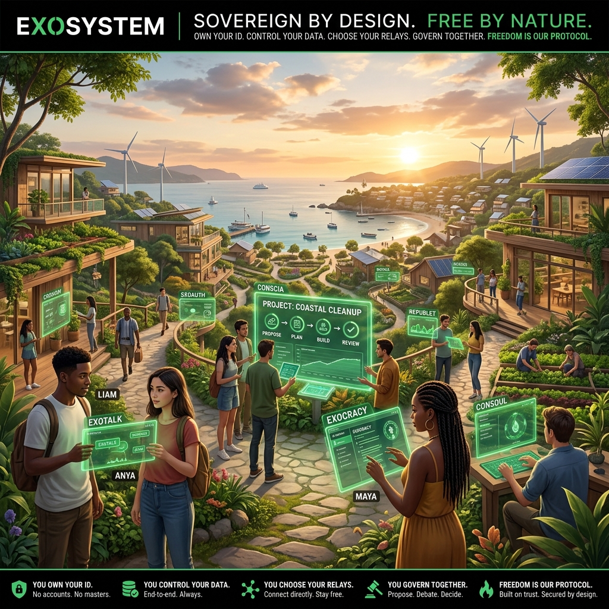

# The Sovereign Exosystem

  

> **"A digital node should be as free as the person who owns it and as connectable as the physics of the internet allows."** — *[The Vision](docs/vision.md)*

Welcome to the root of the **Sovereign Exosystem**. This monorepo is the forge for a decentralized, zero-harvesting communications stack designed to defend digital sovereignty in an era of centralized hegemony and algorithmic "kill chains."

---

## 📖 The Manifest

  

Before contributing or deploying, align your frequency with the core philosophy:
*   **[The Vision](docs/vision.md)**: Identity sovereignty, data locality, and publisher-led aggregation.
*   **[The Sovereign Saga](docs/scenarios/sovereign_saga.md)**: Our narrative framework for digital resistance.
*   **[Agent Protocol](agent.md)**: The "Bible" for AI and human agents operating in this SDLC.

---

## 🚀 The Application Triad
We build in threes. Each application is designed for multi-dimensional resilience across mobile, desktop, and web.

### 💬 ExoTalk — *Sovereign Messaging*
The flagship. Encrypted, offline-first gossip via Willow and Iroh.
- **[exotalk_flutter/](exotalk_flutter/README.md)**: High-density desktop client.
- **[exotalk_web/](exotalk_web/README.md)**: Wasm-based entry point.
- **[exotalk_engine/](exotalk_engine/README.md)**: The Rust-powered P2P heart.

### 💳 Exonomy — *Social Voucher Exchange*
Decentralized social credit and exchange without intermediate brokers.
- **[exonomy_lite/](exonomy_lite/README.md)**: Mobile P2P client.
- **[exonomy_flutter/](exonomy_flutter/README.md)**: Desktop management.
- **[exonomy_web/](exonomy_web/README.md)**: Indexing node.

### 🗳️ Exocracy — *Project Governance*
Fluid, cryptographically-verified decision making for the autonomous age.
- **[exocracy_lite/](exocracy_lite/README.md)** | **[exocracy_flutter/](exocracy_flutter/README.md)** | **[exocracy_web/](exocracy_web/README.md)**

### 📚 RepubLet — *Scientific Publishing*
Verifiable, immutable archival of human knowledge.
- **[republet_lite/](republet_lite/README.md)** | **[republet_flutter/](republet_flutter/README.md)** | **[republet_web/](republet_web/README.md)**

---

## 🏗️ Core Infrastructure
The shared backbone that powers the Exosystem.

*   **[conscia/](conscia/README.md)**: **The Sovereign Lifeline.** A first-class, headless beacon and HA relay daemon.
*   **[exoauth/](exoauth/README.md)**: **The Universal Passport.** Portable Ed25519 identity synthesis and FFI plugin.
*   **[infra/](infra/README.md)**: Signaling relays, diagnostic bridges, and monitoring tools.

---

## 📚 Documentation Vault
The Exosystem is documented as a living history.

*   **[Knowledge Hub (docs/)](docs/README.md)**: Centralized specs and scenarios.
*   **[Functional Specs](docs/spec/README.md)**: The "Ground Truth" for architectural standards.
*   **[Walkthroughs](docs/walkthroughs/README.md)**: Sequential records of every development session.
*   **[License](docs/license.md)**: Proudly published under **AGPL-3.0**.

---

## 🤖 Agentic SDLC (BMAD)
This repository is managed via an **Event-Driven Multi-Agent SDLC**.
- **[Spec 31](docs/spec/31_bmad_agile_methodology.md)**: Meet the AI Workforce (The Sovereign PM, Iroh Expert, etc.).
- **[Spec 32](docs/spec/32_archon_workflow_standard.md)**: High-fidelity automation standards.

---

### 🧠 Brain Context: The Pappus Root
The root README is the **Pappus**—the seed that carries the entire genetic code of the project. It serves as the primary "Solid Front Door" for both humans and AI agents entering the swarm.

---
*Created with intent on Exocracy.local. Verified via KDVV.*
