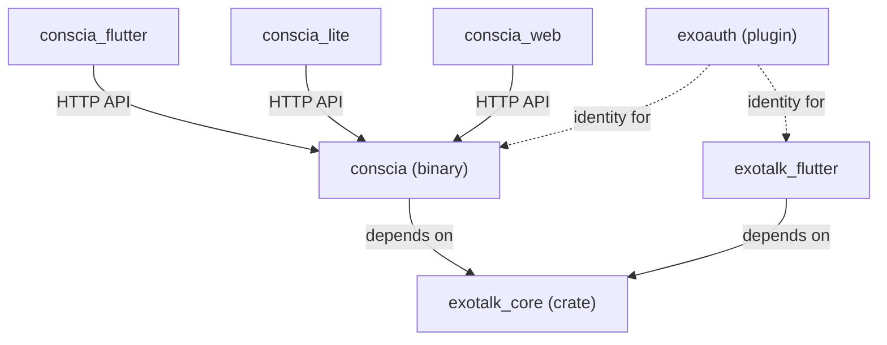

# Conscia Citizenship Extraction

Conscia is the Beacon — the HTTP gateway, blind indexer, and federation broker for every application in the Exosystem. It currently resides inside `exotalk_engine/conscia/`, implying it is a sub-component of ExoTalk. This is architecturally incorrect. Conscia serves ExoTalk, Exonomy, Exocracy, RepubLet, and ThreeSteps equally. It must be promoted to a first-class monorepo citizen with full Triad parity.

## Proposed Changes

### 1. Rust Crate Extraction

#### [NEW] `conscia/` (top-level)
Promote the Rust binary crate from `exotalk_engine/conscia/` to `conscia/` at the monorepo root. This directory becomes the canonical home for the daemon, its embedded dashboard assets, and its `Cargo.toml`.

#### [MODIFY] `conscia/Cargo.toml`
Update the `exotalk_core` dependency path from `path = "../exotalk_core"` to `path = "exotalk_engine/exotalk_core"` (or wherever `exotalk_core` resides relative to the new location).

#### [DELETE] `exotalk_engine/conscia/`
Remove the original nested directory after confirming the top-level crate compiles.

---

### 2. Triad Scaffolding

Establish full Triad parity as defined in Spec 22:

#### [NEW] `conscia_flutter/`
Desktop-first Flutter admin client for Consciosophers and node operators. This replaces the single embedded `index.html` dashboard with a proper, full-featured Flutter desktop application providing:
- Real-time peer topology visualization
- Governance petition review and approval UI
- Blind index management and search
- SDUI widget preview (what host apps are rendering)

#### [NEW] `conscia_lite/`
Mobile-first Flutter client for on-the-go node monitoring. Minimal feature set:
- Node health status (Online/Offline/Sleeping)
- Push notification for incoming petitions
- Quick-approve/deny governance actions

#### [NEW] `conscia_web/`
The existing embedded `index.html` dashboard, extracted and elevated into a standalone Flutter Web application served by the daemon. This provides browser-based access to the same admin capabilities as `conscia_flutter/`.

---

### 3. Infrastructure Updates

#### [MODIFY] `infra/` (systemd services)
Update `ExecStart` paths in all Conscia-related systemd unit files on the Exonomy node:
- `conscia.service`
- `exotalk-zrok-conscia.service`

#### [MODIFY] Deployment scripts
Update any `scp` or build commands that reference the old `exotalk_engine/conscia/` path.

#### [MODIFY] `exotalk_engine/` workspace `Cargo.toml`
Remove `conscia` from the workspace members list (if applicable).

---

### 4. Documentation Updates

#### [MODIFY] `docs/spec/22_application_triad_architecture.md`
Add Conscia to the Triad table alongside Exonomy, Exocracy, and RepubLet.

#### [MODIFY] `docs/spec/19_verification_telemetry_api.md`
Update any path references to the Conscia source.

#### [MODIFY] `docs/spec/36_exonomy_deployment_standard.md`
Update deployment paths for the Conscia binary.

#### [MODIFY] `agent.md`
Update any references to `exotalk_engine/conscia/` if present.

---

### 5. Shared Engine Dependency

> [!IMPORTANT]
> Conscia must retain its dependency on `exotalk_core` (which provides `network_internal` and `protocol_internal`). The extraction does NOT mean Conscia gets its own P2P engine. It means the binary, its assets, and its front-end tiers are no longer nested inside `exotalk_engine/`.

The dependency graph after extraction:

## Verification Plan

### Automated Tests
- `cargo check` on the new top-level `conscia/` crate.
- `cargo build --release` to verify the binary produces correctly.
- `flutter analyze` on `conscia_flutter/` and `conscia_lite/` scaffolds.

### Manual Verification
- Deploy the relocated binary to the Exonomy node via the standard deployment pathway.
- Verify `systemctl status conscia` starts successfully with the updated paths.
- Verify `https://conscianikolasee.share.zrok.io` remains reachable after the relocation.
