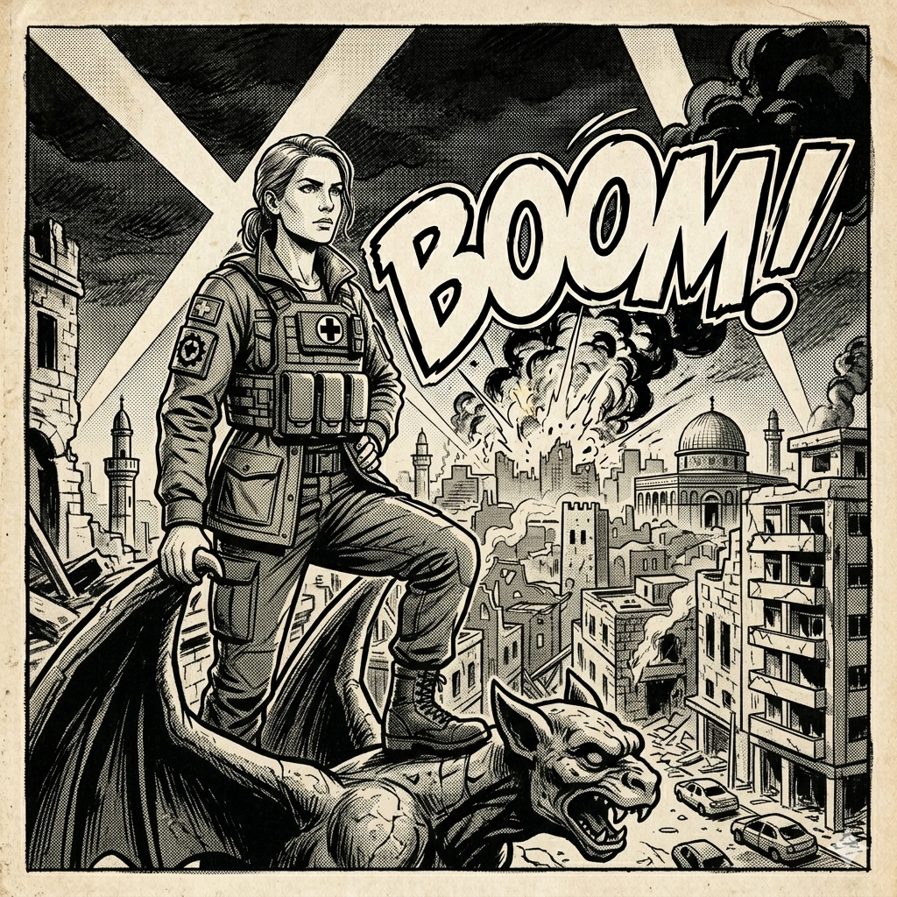
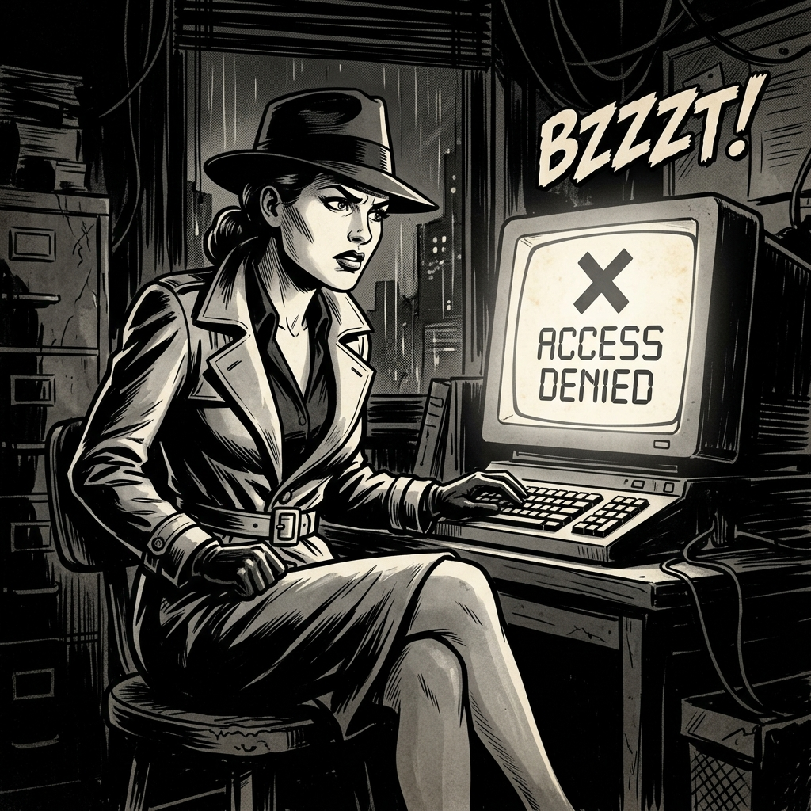
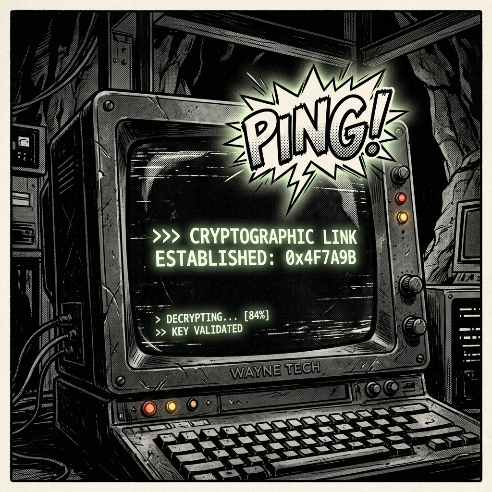
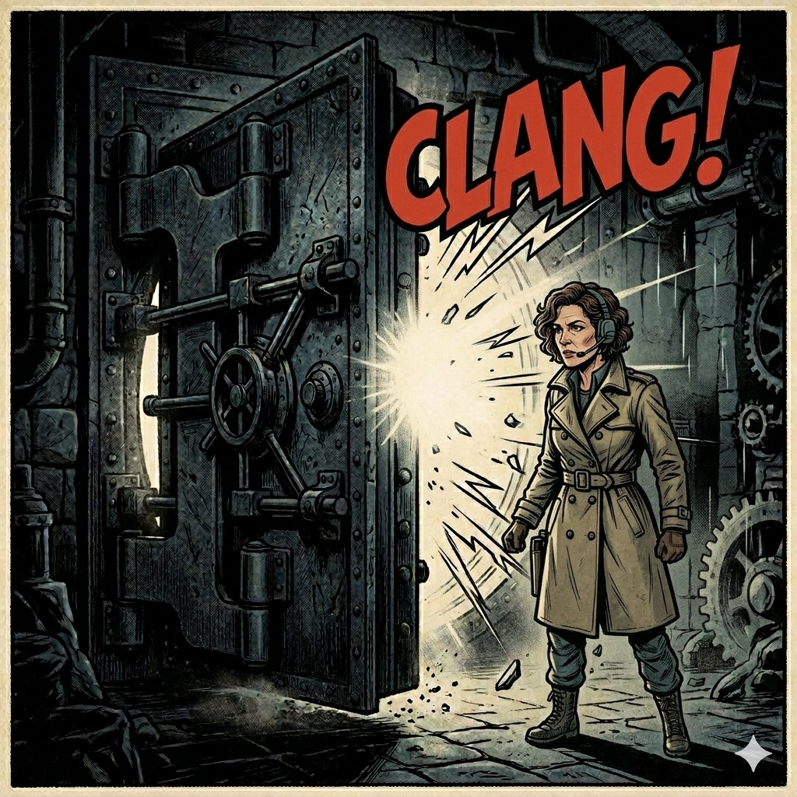
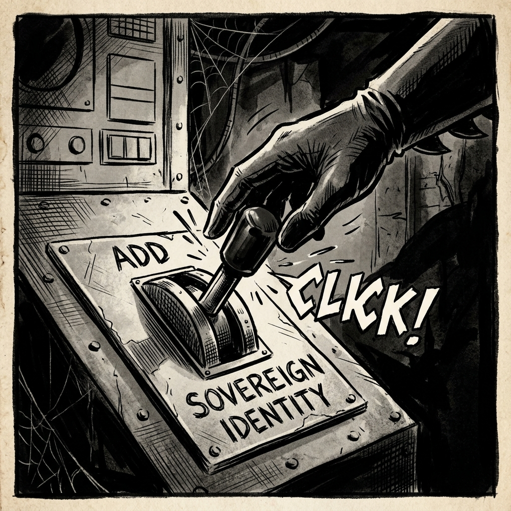
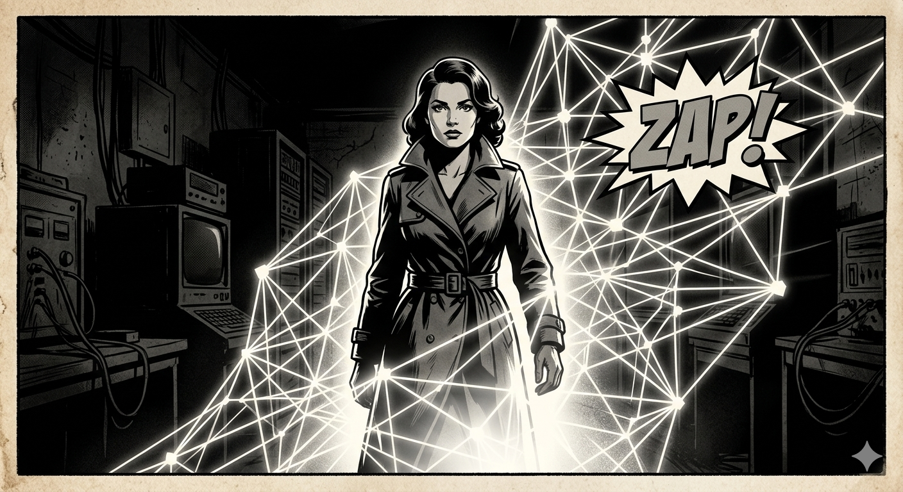

# Screenplay 00: The Solid Front Door (Comic Strip View)

This document presents the first scenario as a 6-frame comic strip storyboard. The voiceover captions accompany each frame.

### Frame 1: The Battlefield

> **Narrator VO**: "In the war-torn regions of the Levant, communication is a battlefield. Isabella, a war crimes expert in East Jerusalem, finds her digital world closing in. Palantir algorithms have flagged her. Her email is a liability."

---

### Frame 2: The Lockout

> **Isabella VO**: "My credentials died an hour ago."

---

### Frame 3: The Dead Drop

> **Isabella VO**: "The Insider sent a dead drop—a link to a 'Sovereign Front Door'."

---

### Frame 4: The Gateway

> **Isabella VO**: "No login. No server. Just an opening into the mesh."

---

### Frame 5: The Choice

> **Narrator VO**: "Sovereignty isn't given; it's claimed."

---

### Frame 6: The Mesh

> **Narrator VO**: "Isabella chooses to build her presence from the ground up, outside the reach of the technocratic empire."
