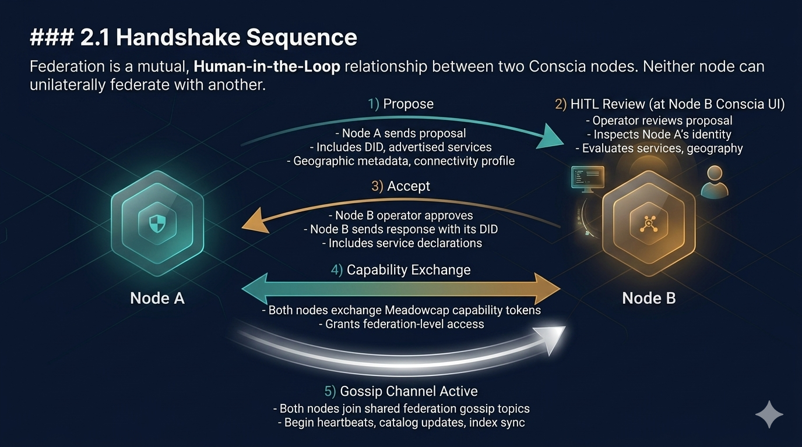
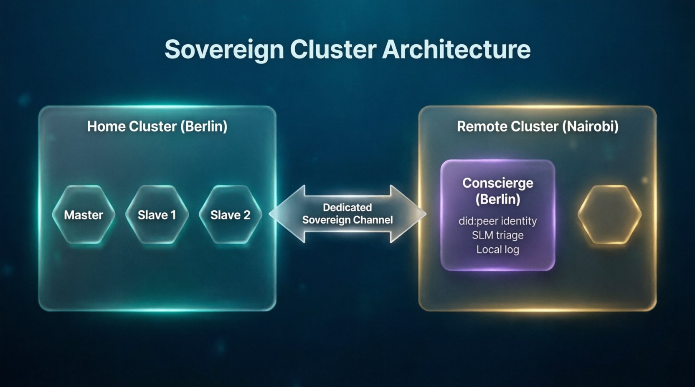
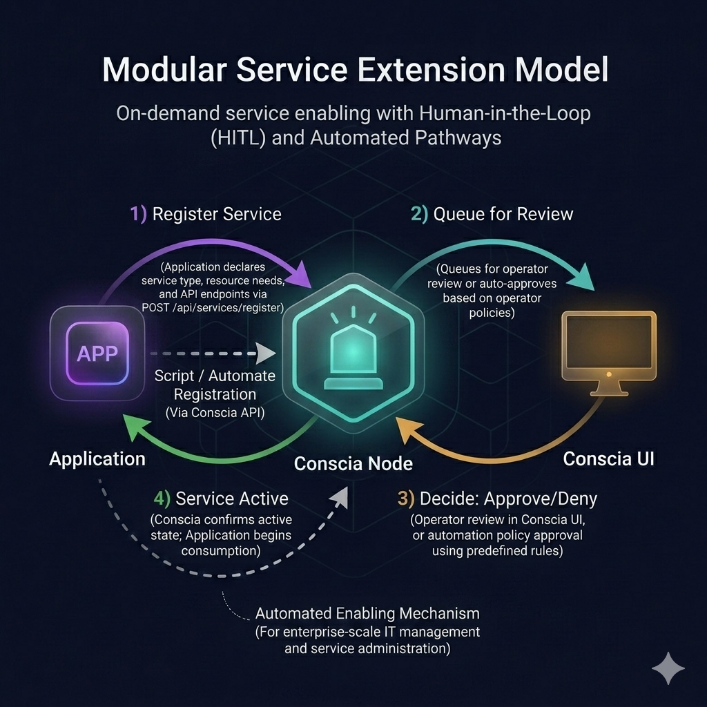

# Specification 38: Conscia Federation & Service Architecture

## 1. Overview

Conscia nodes are the sovereign infrastructure backbone of the Exosystem. Each node operates as an autonomous, headless P2P participant that provides enabling services — relay, indexing, discovery, persistence, authentication, observability, and federation — without exercising control over user content.

This specification defines:
- The federation protocol by which Conscia nodes discover and peer with one another
- The service catalog that Conscia exposes to all consuming applications
- The geographic and latency-aware routing model
- The disaster recovery and high availability posture
- The modular service extension model for future applications
- The Conscierge diplomatic sidecar for enterprise-scale inter-cluster federation
- The observability stack (Prometheus + Grafana)

---

## 2. Federation Protocol

### 2.1 Handshake Sequence

Federation is a mutual, Human-in-the-Loop relationship between two Conscia nodes. Neither node can unilaterally federate with another.

**Step-by-step:**

1. **Propose**: Node A sends a federation proposal to Node B, including its DID, advertised services, geographic metadata, and connectivity profile.
2. **HITL Review**: Node B's operator reviews the proposal in the ConSoul interface. They can inspect Node A's identity, service offerings, and geographic context before deciding.
3. **Accept**: Node B's operator approves. Node B sends an acceptance response including its own DID and service declarations.
4. **Capability Exchange**: Both nodes exchange Meadowcap capability tokens granting each other appropriate federation-level access.
5. **Gossip Channel Active**: Both nodes join shared federation gossip topics (see §2.3) and begin exchanging heartbeats, catalog updates, and index synchronization data.

### 2.2 Federation Lifecycle

| State | Description |
|---|---|
| **Proposed** | One node has sent a proposal; the other has not yet responded. |
| **Active (Mutual)** | Both nodes have accepted; bidirectional sync and management are enabled. |
| **Active (Directional)** | One node acts as a Source of Truth; the other acts as a Sink for downstream publishing. |
| **Suspended** | One node has temporarily paused the relationship (maintenance, policy change). |
| **Revoked** | One node has permanently severed the relationship; shared indexes are cleaned up. |

### 2.3 Directional Federation (Downstream Publishing)

Federation can be established as a directional relationship where one Conscia node (Source) publishes to another (Sink) without reciprocal sync.

- **Source of Truth**: The authoritative node for a specific domain (e.g., a global catalog, an academic archive, or cold storage inventory).
- **Sink Node**: The receiving node that mirrors the source for local discovery and consumption but does not contribute data back to the source.
- **Use Cases**: 
    - **Reference Libraries**: Distributing static or slowly-changing canonical documents.
    - **Service Catalogs**: Publishing available global voucher types or payment gateways.
    - **Archive Mirrors**: Downstream propagation of massive datasets for regional access.
    - **Operational Templates**: Distributing standard SDUI blueprints from an enterprise master to satellite clusters.

---

## 3. Inter-Conscia Gossip Topics

### 3.1 Topic Catalog

Federated nodes communicate via dedicated Willow namespace topics. Each topic is scoped to the federation relationship and governed by the exchanged Meadowcap tokens.

| Topic | Purpose | Frequency |
|---|---|---|
| `conscia_federation_heartbeat` | Periodic liveness pings with latency measurements and resource utilization snapshots | Every 30s (configurable) |
| `conscia_federation_catalog` | Service capability advertisements and updates (new services enabled, removed, or reconfigured) | On change + periodic refresh |
| `conscia_federation_index_sync` | Metadata index propagation — public metadata tags from one node's blind index replicated to federated peers for broader search coverage | Continuous (batched) |
| `conscia_federation_governance` | Petition forwarding (a petition submitted to Node A can be relayed to Node B if Node B hosts the relevant service), capability delegation, and cross-node authorization events | On event |
| `conscia_federation_geo_updates` | Geographic routing table updates — changes to content locality rules, latency threshold adjustments, replication preference shifts | On change |
| `conscia_federation_health` | Detailed health telemetry exchange — storage utilization, CPU load, memory pressure, active connection counts — enabling federated nodes to make informed load-balancing decisions | Every 60s (configurable) |

---

## 4. Geographic & Latency-Aware Routing

### 4.1 Node Geographic Metadata

Each Conscia node optionally declares its geographic context:

| Field | Description | Example |
|---|---|---|
| `region` | Broad geographic region | `eu-central`, `af-east`, `na-west`, `sea` |
| `locality` | Specific locality descriptor | `berlin`, `nairobi`, `manila`, `são-paulo` |
| `connectivity_profile` | Network environment | `datacenter`, `home_broadband`, `cellular`, `satellite`, `mesh_relay` |

Nodes that do not declare geographic metadata are treated as "region-agnostic" and participate in federation without geographic routing preferences.

### 4.2 Content Locality Rules

Node operators configure content locality policies via the ConSoul interface. These rules govern how metadata and relay traffic are distributed across the federation network.

| Rule Type | Description | Use Case |
|---|---|---|
| **Replication affinity** | Prefer replicating metadata to nodes in specific regions | A Nairobi parish wants circle metadata to stay on African nodes for latency and data sovereignty |
| **Replication exclusion** | Prevent metadata from reaching specific regions | Sensitive community data must not leave a geographic boundary |
| **Latency threshold** | Maximum acceptable round-trip time for synchronization partners | A real-time coordination circle requires sub-200ms sync partners |
| **Bandwidth priority** | Allocate relay bandwidth preferentially to specific federation peers | A high-traffic urban node needs guaranteed bandwidth to its primary cluster |
| **Failover preference** | Designate preferred failover nodes by geographic proximity | If the Berlin node goes down, route to Frankfurt before London |
| **Cold storage affinity** | Prefer pinning archival content on nodes with specific storage profiles | RepubLet datasets pinned to datacenter nodes, not cellular relays |

Content locality rules are propagated to federated peers via the `conscia_federation_geo_updates` gossip topic so that the entire federation network can make informed routing decisions.

### 4.3 Latency-Aware Peer Selection

When a client application needs to connect to a Conscia node, the node's geographic and latency metadata helps the client select the best available peer. The `GET /api/federation/peers` endpoint returns latency measurements alongside geographic data, enabling clients to sort and filter by proximity.

---

## 5. Service Architecture

### 5.1 Capabilities vs. Services

Conscia distinguishes between two API surfaces:

| Surface | Endpoint | Purpose | Primary Consumer |
|---|---|---|---|
| **Capabilities** | `GET /api/capabilities` | Client-facing: "What can I see? What SDUI widgets should I render?" | Synesys, ExoTalk, and all consumer apps |
| **Services** | `GET /api/services` | Operator-facing: "What is this node running? What can I configure?" | ConSoul interface (admin) |

This separation enforces the admin-vs-consumer boundary:
- A Synesys browser calls `/api/capabilities` to learn which widgets to paint
- A ConSoul operator calls `/api/services` to manage what is enabled, configured, and monitored

### 5.2 Service Catalog

Conscia provides a modular, decoration-based service surface. Services are not rigidly classified by consuming application — they are **decorations** that any application can leverage based on its needs. Every Exosystem application ships with the `exotalk_engine` core, which means every app inherently benefits from relay, chat, and P2P transport services.

#### Core Services (Always Available)

| Service | Description | API Surface |
|---|---|---|
| **Discovery** | Public identity, health, and geographic metadata | `GET /api/discovery` |
| **Capability Governance** | Petition, authorization, and verification | `POST /api/capabilities/petition`, `POST /api/capabilities/verify` |
| **SDUI** | Dynamic widget blueprints for client rendering | `GET /api/capabilities` |
| **Log Streaming** | Real-time system logs via SSE | `GET /api/logs/stream` |
| **Observability** | Prometheus metrics export + Grafana dashboard integration | `GET /metrics` |

#### Extended Services (Operator-Configured)

| Service | Description | API Surface |
|---|---|---|
| **Relay** | TURN/STUN for NAT traversal and traffic relay. Available to all apps — every Exosystem application includes ExoTalk chat and benefits from relay services. | `GET /api/services/relay/status` |
| **Blind Indexing** | Public metadata ingestion and search. Used by any app that needs discoverable public metadata — circle directories, voucher listings, project catalogs, dataset registries. | `POST /api/index/metadata`, `GET /api/index/search` |
| **Forum Hosting** | Creation and hosting of public forums. Forums can organize circles (ThreeSteps), working groups (RepubLet scientists, Exocracy professional associations), or any community structure that benefits from Conscia-hosted public indexing. | `GET /api/forums`, `POST /api/forums` |
| **Cold Storage Pinning** | Persistent storage for content-addressed blobs. Available to any app — RepubLet for datasets, Exocracy for project archives, ExoTalk for media persistence, or temporary rented pinning for time-limited campaigns. | `POST /api/services/storage/pin`, `GET /api/services/storage/inventory` |
| **Federation** | Inter-Conscia peering, gossip, and cross-node coordination | `GET /api/federation/peers`, `GET /api/federation/topology` |
| **Authentication Proxy** | Decentralized AuthN/AuthZ for external apps requiring Conscia-verified identity | `POST /api/services/auth/policy` |

### 5.3 The Decoration Principle

Services are not owned by applications — they are **offered** by Conscia nodes and **decorated onto** any application that benefits from them. This multipurpose design philosophy maximizes the value of decentralized networking topologies by connecting people through shared infrastructure rather than siloed, per-app service stacks.

Examples of cross-pollination:
- **Forums** hosting RepubLet research working groups alongside ThreeSteps faith circles
- **Cold storage** pinning Exocracy project archives temporarily for a crowdfunding campaign, then releasing the pins when the campaign concludes
- **Relay** serving ExoTalk group chats, Exonomy real-time voucher negotiations, and Exocracy live project status updates — all over the same TURN/STUN infrastructure
- **Blind indexing** surfacing ThreeSteps circle metadata, Exonomy voucher market listings, and RepubLet dataset registries through a single unified search surface

The node operator decides which services to enable. Applications discover which services are available via `GET /api/capabilities` (consumer) or `GET /api/services` (admin) and adapt accordingly.

---

## 6. ConsciaLet: The Federation Interface

### 6.1 Concept: The Government Lobby
**ConsciaLet** is a high-fidelity federation module exposed as a server-driven UI (SDUI) component within the **ConSoul** administrative interface. It functions as a "Government's Lobby"—a secure, localized space where the node operator manages the node's external relationships.

### 6.2 Peer Registration & Management
Through ConsciaLet, operators can:
- **Register Peers**: Manually add or scan `did:peer` IDs of other Conscia nodes to initiate the federation handshake (§2.1).
- **Remote Relationship Management**: Define and adjust Meadowcap capability delegations for federated peers without leaving the local environment.
- **Topology Oversight**: Visualize the local mesh neighborhood and monitor the health of active federation channels.

### 6.3 SDUI Integration
ConsciaLet is injected into the ConSoul navigation rail via the `federationAdministration` capability. It leverages the **Application Triad** architecture to ensure that the management of these sovereign relationships remains strictly local and private to the node operator.

---

## 7. Observability

### 6.1 Prometheus

Every Conscia node exposes a Prometheus-compatible metrics endpoint at `GET /metrics`. Metrics include:
- P2P connection counts and throughput
- Blind index size and query latency
- Relay bandwidth utilization
- Storage pin count and volume
- Federation heartbeat latency per peer
- Gossip topic message rates

### 6.2 Grafana

Conscia nodes are designed to integrate with Grafana for visual observability dashboards. Node operators can deploy Grafana alongside their Conscia cluster to monitor:
- Federation health across all peered nodes
- Geographic distribution of traffic and content
- Service utilization trends over time
- Alert thresholds for storage, latency, and availability

The ConSoul interface surfaces key Prometheus metrics directly, but Grafana provides the deep, time-series analysis layer for enterprise operators managing multiple clusters.

---

## 7. Disaster Recovery & High Availability

### 7.1 Clustering Model

As defined in **[Spec 06](./06_high_availability.md)**, Conscia nodes support a 3-node clustering model for enterprise deployments. Federation extends this to cross-geography redundancy.

### 7.2 Failover Semantics

| Scenario | Behavior |
|---|---|
| **Single node offline** | Federated peers continue serving indexed metadata; clients reroute to nearest healthy node |
| **Cluster master offline** | Slave node promotes to master; no data loss due to continuous replication |
| **Network partition** | Nodes continue operating independently; reconciliation occurs on reconnection via range-based set reconciliation |
| **Geographic dispersion** | Content locality rules ensure regional nodes maintain sufficient replicas to serve local clients regardless of remote node availability. A missionary in East Africa continues operating via the Nairobi node even if the Berlin cluster is unreachable. A metropolitan parish in Europe continues via Frankfurt even if transcontinental links are degraded. |

### 7.3 Recovery Coordination

Federated nodes assist in recovery by:
- **Metadata replay**: providing replicated metadata indexes during outages so search and discovery remain available
- **Relay rerouting**: redirecting clients that depended on the downed node to the nearest healthy alternative, respecting geographic preferences
- **Topology broadcast**: advertising updated federation graph information so clients can discover alternative nodes without manual intervention
- **Reconciliation on reconnect**: when a partitioned node comes back online, range-based set reconciliation automatically identifies and fills gaps in its metadata index — no manual resync required
- **Health history**: maintaining a historical record of outage events, recovery times, and degradation patterns, available via `GET /api/federation/peers` for transparency to clients and operators

---

## 8. The Conscierge: Diplomatic Sidecar for Enterprise Federation

### 8.1 Concept

When Conscia clusters grow to enterprise scale — potentially serving millions of node-local users consistently hitting their own cluster — the inter-cluster communication overhead can become a bottleneck. The **Conscierge** is a lightweight sidecar process that runs remotely on a federated cluster's infrastructure, acting as a diplomatic agent on behalf of its home cluster.

### 8.2 Architecture

The Conscierge operates as:
- A **cloud-based service account** with its own `did:peer` identity and full ExoTalk functionality built into the sidecar
- A **small yet busy process** running on the remote cluster, loaded with one or more small language models (SLMs) to facilitate sync, governance, and communication tasks
- A **localized AI agent** that can triage petitions, pre-filter governance events, summarize cross-cluster status, and assist with automated federation administration

### 8.3 Capabilities

| Capability | Description |
|---|---|
| **Petition triage** | The Conscierge pre-screens incoming petitions using SLM-driven policy evaluation, forwarding only those that require HITL review to the home operator |
| **Governance summarization** | Summarizes cross-cluster governance events (capability grants, revocations, federation state changes) into digestible reports |
| **Sync optimization** | Uses SLM inference to prioritize which metadata batches to sync first based on demand patterns and content relevance |
| **Communication proxy** | Maintains its own ExoTalk chat identity, enabling asynchronous communication between cluster operators via the Conscierge's sovereign messaging channel |
| **Telemetry logging** | Keeps all internal logs and non-host telemetry in its own local store, separate from the host cluster's data — maintaining sovereignty over its operational records |
| **Health monitoring** | Continuously monitors the health of its host cluster and reports back to the home cluster via federation gossip topics |

### 8.4 Deployment Model

The Conscierge is deployed by the home cluster's operator onto the remote cluster's infrastructure (with the remote operator's consent, mediated by the federation handshake). Each cluster can host Conscierges from multiple federation partners.

---

## 9. Modular Service Extension Model

### 9.1 Principle

Conscia's understanding of application needs is modular. Each application registers its service requirements via the Conscia API. The node operator, when Human-in-the-Loop intervention is necessary, may review and enable services on demand. However, application registration and service enabling can also be scripted and automated via the Conscia API for enterprise-scale IT management and application/service administration.

### 9.2 Registration Flow

1. **Register**: Application declares the service type, resource requirements, and API endpoints it needs via `POST /api/services/register`.
2. **Queue for review**: Conscia node queues the registration for operator review (or auto-approves if the operator has pre-configured automation policies).
3. **Approve / Deny (HITL or automated)**: Operator reviews and approves in the ConSoul interface, or the automation policy approves based on predefined rules.
4. **Service Active**: Conscia confirms the service is active; the application begins consuming it.

---

## 10. The Discovery Response (Expanded)

The `GET /api/discovery` endpoint serves as the public identity card of a Conscia node. The response includes:

| Field | Description |
|---|---|
| `did` | The node's sovereign `did:peer` identity |
| `node_id` | The Iroh network node identifier |
| `node_name` | Human-readable name assigned during onboarding |
| `version` | Conscia daemon version |
| `region` | Geographic region (optional) |
| `locality` | Specific locality descriptor (optional) |
| `connectivity_profile` | Network environment type (optional) |
| `services` | List of active service identifiers |
| `federation_active` | Whether the node participates in inter-Conscia federation |
| `federated_peer_count` | Number of active federation peers |
| `uptime` | Time since last daemon restart |
| `operator_contact` | Optional operator contact URI (for petition follow-up) |
| `os` | Host operating system (e.g., `linux`, `darwin`, `windows`) |
| `arch` | CPU architecture (e.g., `x86_64`, `aarch64`) |
| `cpu_cores` | Number of available CPU cores |
| `memory_total_mb` | Total system memory in megabytes |
| `storage_available_gb` | Available storage capacity in gigabytes |
| `kernel_version` | Kernel version string |

The hardware profile fields allow consuming applications and federation partners to make informed decisions about node capacity, compatibility, and suitability for resource-intensive services like cold storage pinning or high-throughput relay.

---

## 11. QR Code Exchange Protocol

Conscia nodes present QR codes encoding structured payloads that any Exosystem application can scan to initiate interaction.

### 11.1 QR Payload Types

| QR Type | Payload | Purpose |
|---|---|---|
| **Node Discovery** | `{ "type": "discovery", "conscia_url": "https://...", "did": "did:peer:...", "node_name": "..." }` | Discover and connect to a Conscia node |
| **Federation Proposal** | `{ "type": "federation", "conscia_url": "https://...", "did": "did:peer:...", "services": [...] }` | Initiate a federation handshake between two Conscia operators |
| **Petition Invite** | `{ "type": "petition", "conscia_url": "https://...", "role_offered": "Reader" }` | Pre-fill a petition for a specific role on a specific node |
| **Circle Join** | `{ "type": "circle_join", "conscia_url": "https://...", "circle_id": "...", "forum_id": "..." }` | Direct link to join a specific circle via a specific Conscia node |

### 11.2 Presentation

The ConSoul interface (**[Campaign 1](../plans/upcoming_milestones_and_fhs.md)**) generates and displays QR codes in relevant screens:
- **Proximity Discovery tab**: Node Discovery QR via `pretty_qr_code` for high-speed Layer A bridging
- **ConsciaLet (Federation tab)**: Petition Invite and Federation Proposal QRs for inter-node handshaking
- **Forum management screen**: Circle Join QR for onboarding followers into specific circles

### 11.3 Consumption

Any Exosystem application can scan any Conscia QR code. The `type` field in the payload tells the scanning app which flow to initiate:
- An app that receives a `discovery` QR adds the Conscia node to its known nodes list
- An app that receives a `federation` QR forwards it to its own ConSoul operator for review
- An app that receives a `petition` QR opens a pre-filled petition submission form
- An app that receives a `circle_join` QR navigates to the circle join flow with the relevant Conscia node and circle pre-selected

The QR system is extensible — new `type` values can be added as the Exosystem evolves without breaking existing scanners (unknown types are gracefully ignored).

---

## 12. Related Documents

- [Spec 06: Conscia Nodes / High Availability](./06_high_availability.md)
- [Spec 11: Meadowcap Capabilities](./11_meadowcap_capabilities.md)
- [Spec 19: Verification & Telemetry API](./19_verification_telemetry_api.md)
- [Spec 22: Application Triad Architecture](./22_application_triad_architecture.md)
- [Conscia Node Management UI](./conscia_manage.md)
- [Conscia SDUI Widget Catalog](./conscia_sdui_widget_catalog.md)
- [Campaign 1: Conscia UI](../plans/upcoming_milestones_and_fhs.md)
- [Campaign 2: Synesys](../external/campaign_2_synesys_conscia_browser.md)
