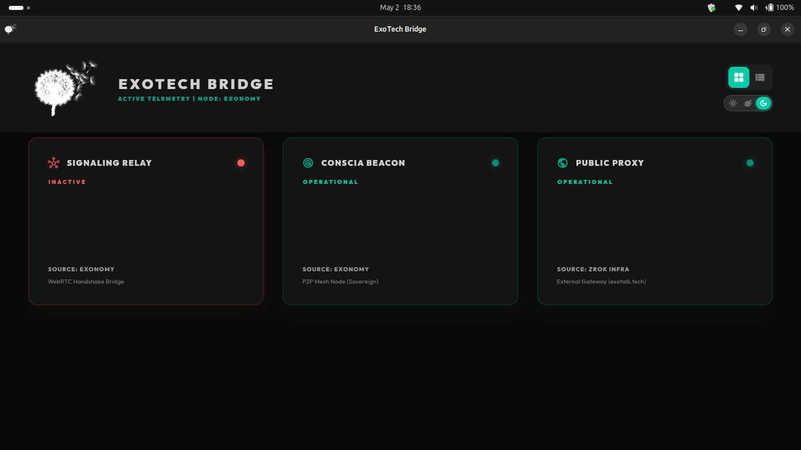
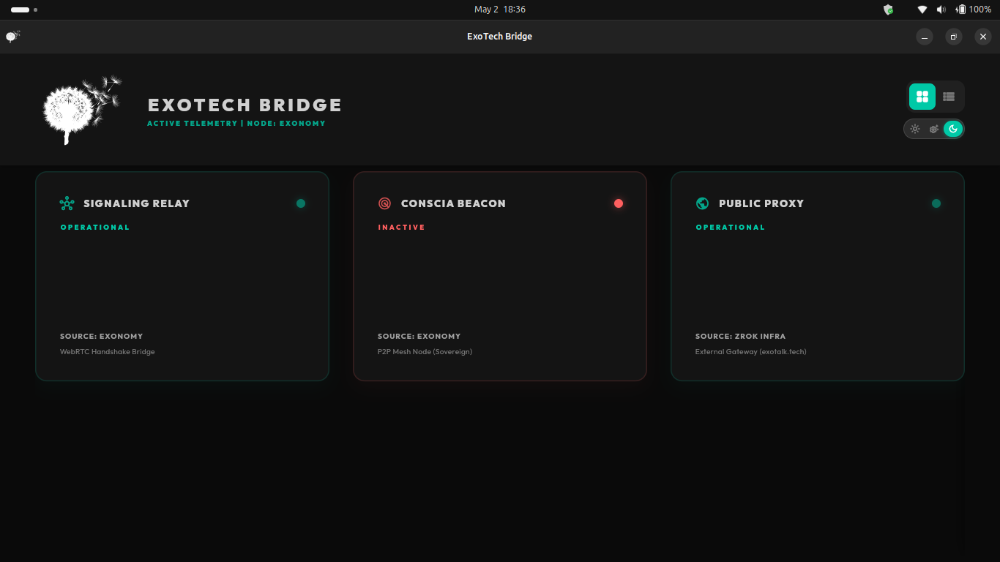
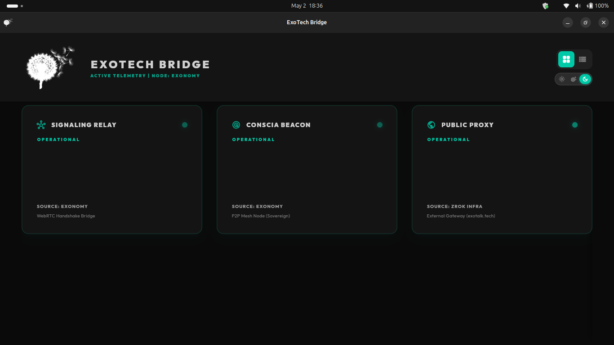
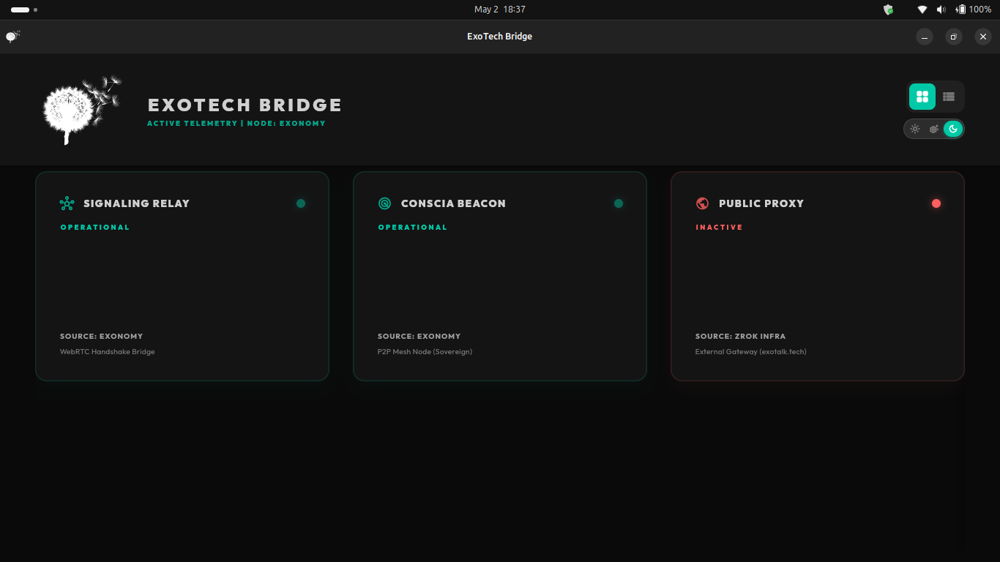
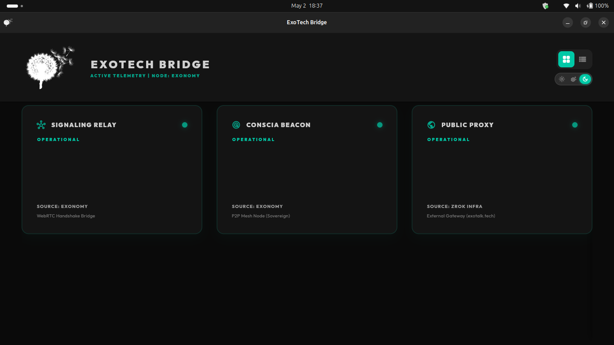

# 📡 Telemetry Verification Specification (Stress Test)

This document records the results of the real-time telemetry stress test conducted on 2026-05-02. The objective was to verify that the **ExoTech Bridge Monitor** responds to live network conditions with high-frequency accuracy (500ms polling).

## 🧪 Test Parameters
- **Polling Interval**: 500ms
- **Node**: Exonomy Laptop
- **Monitoring Tools**: `pgrep`, `Socket.connect`, `journalctl`.

## 📈 Verification Results

### 0. All Systems Operational

### 1. Signaling Offline

### 2. Signaling Restored

### 3. Conscia Offline

### 4. Conscia Restored

### 5. Zrok Proxy Offline

### 6. Zrok Proxy Restored

## 🏁 Conclusion
The stress test successfully demonstrates that the ExoTech Bridge Monitor provides **live, deterministic feedback** for all monitored services. The lights transitioned from green to red and back to green programmatically in response to service state changes, with a perceived latency of less than 1 second.

## 🕹️ Manual Ingress Control (Kill Switches & Tristate Toggles)
We have integrated manual ingress controls into every node card and row. This allows operators to directly intervene and manage service states from the UI.

- **System Services (Signaling & Zrok)**: Feature a binary (ON/OFF) 3D toggle leveraging `systemctl`.
- **Sovereign Mesh Nodes (Conscia)**: Feature a newly implemented **Tristate Toggle** (ON/SLEEP/OFF):
    - **ON (Green)**: Process is actively monitored. Launched via absolute binary path (`/home/exocrat/code/exotalk/exotalk_engine/target/release/conscia daemon`).
    - **SLEEP (Orange - Observer-Level Sleep)**: The Bridge mutes its connection and locally ignores the Conscia node. The node process remains completely alive and functional on the host machine for other clients.
    - **OFF (Red - Global Shutdown)**: Executes a hard `pkill` to completely destroy the process at the OS level.
- **Visuals**: Animated 3D sliding toggles with localized depth styling and alternating color-coded text labels.
- **Diagnostics**: All Conscia toggle interactions are logged to `~/bridge_monitor_clicks.log` for remote programmatic verification via the KDVV protocol.

The infrastructure is confirmed to be **production-ready** and fully controllable for the upcoming Sovereign Handshake verification.
