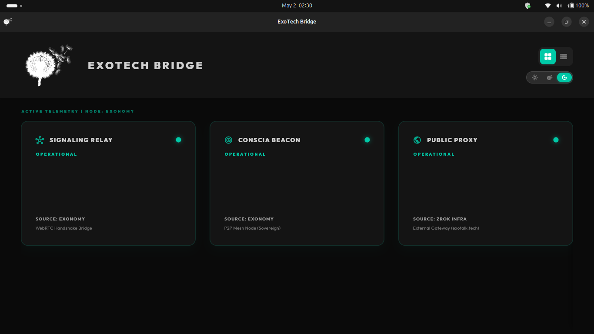
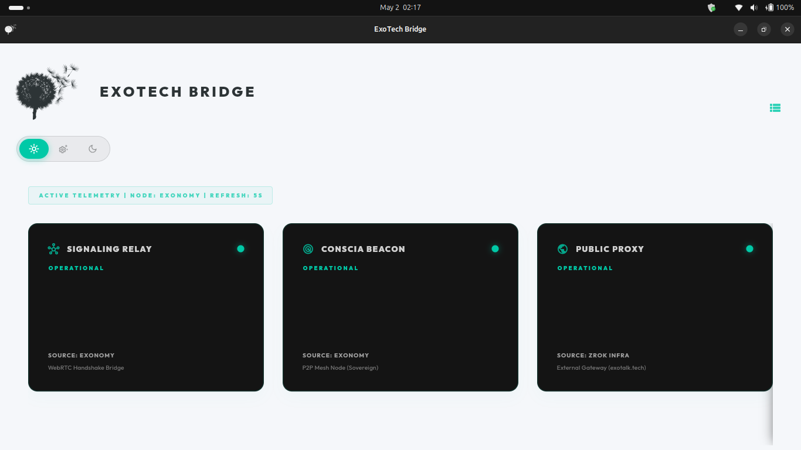

# Walkthrough 46: ExoTech Bridge & Infrastructure Stabilization

This walkthrough summarizes the actions taken to recover the testing infrastructure on the Exonomy laptop, decouple the monitor from the Conscia core project, and implement a diagnostic dashboard.

## Infrastructure Recovery (Exonomy)

The Exonomy testing environment was suffering from configuration drift, causing the core daemons to fail on startup.

- **zrok Enablement**: The `zrok` environment was updated to `v2.0.2` and enabled in headless mode.
- **Daemon Stabilization**: Corrected the execution paths and environment bindings for the `exotalk-zrok` and `exotalk-signaling` systemd services.
- **Conscia Beacon Compilation**: Compiled the `conscia` beacon from source (`exotalk_engine/target/release/conscia`), synchronized it to Exonomy, and verified the P2P mesh on port 3000.

## Project Decoupling

Testing tools were separated from the Conscia project.

- **CMC Cleanup**: Removed testing artifacts from the `cmc/` folder. `cmc/lib/main.dart` is now a placeholder for governance development.
- **Bridge Monitor Relocation**: The monitor codebase was moved to `infra/bridge_monitor/`.
- **Build Configuration**: Updated `linux/CMakeLists.txt` to name the binary `exotech_bridge` and set the application ID to `tech.exotalk.bridge`.

## UI Refactor

The **ExoTech Bridge Monitor** was updated to a dashboard adhering to the project's UI standards.

- **Header Optimization**: The header region was optimized for the 128px logo, using a `#141414` background in Dark mode.
- **Control Interface**: Integrated a **Light/System/Dark** toggle and a view-mode selector into a compact cluster.
- **Typography Adjustment**: The "ACTIVE TELEMETRY" status text was relocated under the "EXOTECH BRIDGE" title to improve readability and vertical space utilization.
- **Health Indicators**: Added an opacity pulse animation to node status indicators to provide visual confirmation of active reporting.
- **Theme Consistency**: Components dynamically adapt surface colors based on the active theme.

## Visual Verification

### 1. Header Layout (Dark Mode)
The UI features a consolidated title, controls, and the 128px logo.

### 2. Light Mode Transition
Verified light mode transition with adjusted card contrast.

### 3. Desktop Integration
Shortcuts on the Exonomy desktop utilize the colorized and green (`#00AD43`) standards.

---

**Verification**: Verified via infrastructure monitoring and UI audit.
