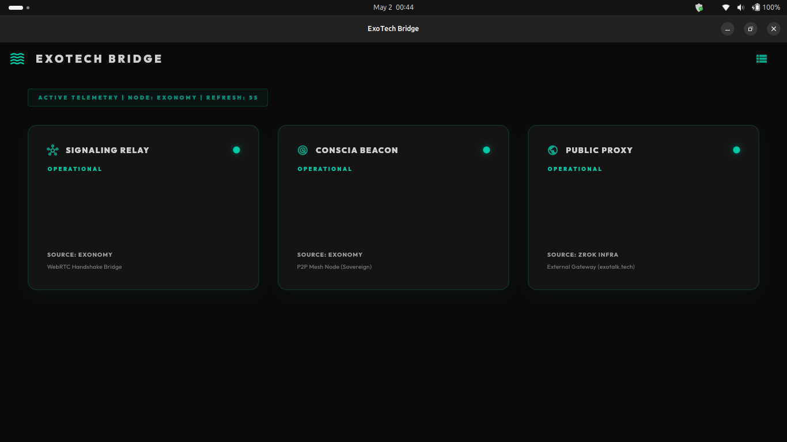
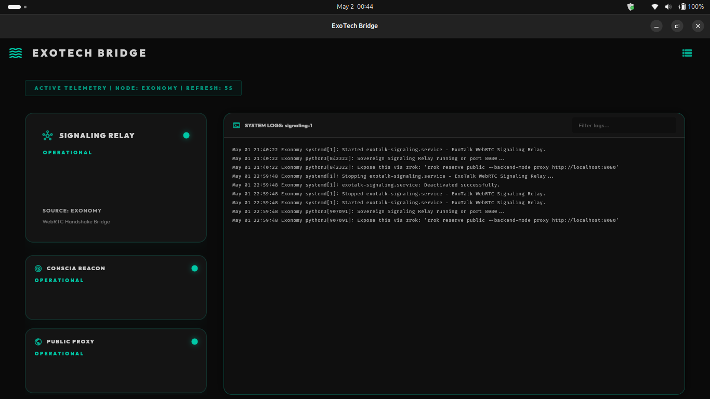

# ExoTech Bridge & Infrastructure Stabilization

This walkthrough summarizes the actions taken to recover the testing infrastructure on the Exonomy laptop, decouple the monitor from the Conscia core project, and implement a premium diagnostic dashboard.

## Infrastructure Recovery (Exonomy)

The Exonomy testing environment was suffering from configuration drift, causing the core daemons to fail on startup.

- **zrok Enablement**: We discovered that the `zrok` environment was not loaded. We upgraded the binary to `v2.0.2` and successfully enabled it using the provided token in headless mode.
- **Daemon Stabilization**: We corrected the execution paths and environment bindings for the `exotalk-zrok` and `exotalk-signaling` systemd services. Both daemons are now persisting reliably across reboots.
- **Conscia Beacon Compilation**: We compiled the core rust-based `conscia` beacon from source (`exotalk_engine/target/release/conscia`), synced it to Exonomy, and launched it locally to ensure the full P2P mesh is active on port 3000.

## Project Decoupling

We finalized the separation of the temporary testing tools from the long-term Conscia project.

- **CMC Purge**: Removed all "Testing Season" artifacts (including the `build/` directory) from the `cmc/` folder. `cmc/lib/main.dart` is now confirmed as a clean placeholder for future governance development.
- **Bridge Monitor Relocation**: The monitor codebase is securely housed in `infra/bridge_monitor/`.
- **Build Cleanliness**: We updated the `linux/CMakeLists.txt` to explicitly name the binary `exotech_bridge` and set the application ID to `tech.exotalk.bridge`, preventing any residual `cmc` naming in the compiled outputs.

## UI Refactor & Dynamic Discovery

The UI was completely overhauled to meet the "Premium Sovereign" aesthetic and remove brittle hardcoded values.

- **Aesthetic Overhaul**: Implemented a dark matte background (`#0A0A0A`), muted teal indicators (`#00C9A7`), and high-legibility geometric typography (`GoogleFonts.outfit`).
- **Dynamic Telemetry**: The dashboard now automatically detects the local hostname (e.g., `EXONOMY`) and actively polls local ports (`8080`, `3000`) and processes (`zrok`) to determine node health, avoiding static labels.
- **View Parity**: The toggle between Card and List views now maintains 1:1 information parity.
- **Educational Commenting**: Exhaustive architectural comments were added to `infra/bridge_monitor/lib/main.dart` to explain the polling mechanisms and UI state management for future maintainability.

> [!TIP]
> The public relay endpoint generated by `zrok` for this session is `jaxk57cbu209.shares.zrok.io`. This tunnel provides external internet access to the local WebRTC signaling relay on port 8080.

## Visual Verification

### 1. Card View (Default Overview)
The default state displaying all local telemetry nodes in a clean, ambient grid.

### 2. Card View (Log Isolation)
Clicking a node shrinks the unselected nodes into a scrollable list, while smoothly sliding out the persistent log viewer on the right.

### 3. List View (Default Overview)
Toggling to List View preserves the state. The unselected state displays high-density tracking rows.

### 4. List View (Log Accordion)
Clicking a row expands the element vertically to reveal the same filterable log viewer in an accordion format.

---

## What's Next

With the Exonomy testing environment stabilized, the daemons running persistently, and the ExoTech Bridge dynamically monitoring the mesh health, we are now ready to:

1. **Deploy the Wasm Node**: Finalize the deployment of the Wasm-compiled `SovereignSession` to the `exotalk.tech` GitHub Pages site, ensuring it connects seamlessly to the Exonomy signaling relay (`jaxk57cbu209.shares.zrok.io`).
2. **Execute Cross-Device Verification**: Use the Exocracy laptop (or an external device) to load the web app and verify the successful WebRTC handshake and P2P connection with the Exonomy Conscia Beacon.
3. **Capture the Sovereign Demo**: Utilize the newly refined ExoTech Bridge to record the visual proof of dynamic P2P discovery during the "Testing Season" demo.
