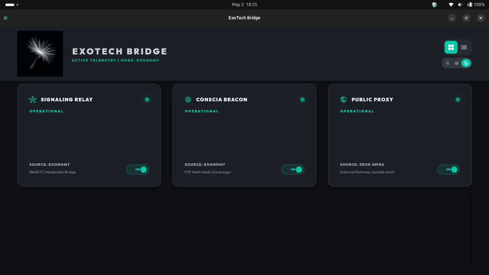

# Walkthrough 47: Educational Stabilization & Handshake Preparation

This walkthrough summarizes the educational enhancement of the codebase, the recovery of the Exonomy infrastructure, and the detailed technical analysis required to fulfill the "Sovereign Handshake" (WebRTC P2P verification).

## 1. Infrastructure Recovery (Exonomy)

Following a comprehensive audit of the Exonomy laptop, we identified that while the signaling relay and zrok proxy were active, the **Conscia Beacon** had failed to persist.

- **Beacon Restoration**: We located the release-optimized `conscia` binary and manually re-initiated the daemon.
- **Visual Verification**: The **ExoTech Bridge Monitor** now confirms a "Triple Green" status:
    - **Signaling Relay**: Operational (Port 8080).
    - **Conscia Beacon**: Operational (Port 3000).
    - **Public Proxy**: Operational (`wq5f16k80d8t.shares.zrok.io`).

## 2. Educational Stabilization

In accordance with `agent.md` directives, we performed a deep-pass of the codebase to ensure technical clarity for junior developers.

- **High-Density Commenting**: Added "🧠 Educational Context" and "💡 Pattern" annotations to:
    - `exotalk_engine/exotalk_wasm/src/lib.rs`: Explaining the Wasm-to-JS bridge and the WebRTC handshake lifecycle.
    - `infra/signaling_server.py`: Documenting the introducer pattern, CORS security, and long-polling rationale.
    - `infra/bridge_monitor/lib/main.dart`: Detailing the 2D stack animation logic, theme state management, and the **refined aesthetic palette** (muted grays and high-depth dark mode).
- **README Hierarchy**: Eliminated "orphaned" documentation by creating and linking new READMEs:
    - [NEW] [infra/README.md](file:///home/exocrat/code/exotalk/infra/README.md)
    - [NEW] [exotalk_engine/exotalk_wasm/README.md](file:///home/exocrat/code/exotalk/exotalk_engine/exotalk_wasm/README.md)
    - [NEW] [exotalk_web/README.md](file:///home/exocrat/code/exotalk/exotalk_web/README.md)
    - [UPDATED] Root [README.md](file:///home/exocrat/code/exotalk/README.md) now provides a clear path to all infrastructure and web components.

## 3. Analysis: The Sovereign Handshake Gap

My investigation revealed that the system is currently in a "Demo Mode" state that prevents true P2P handshake completion:

1.  **Wasm Incompleteness**: The `exotalk_wasm` engine initializes `RtcPeerConnection` but stops before creating an SDP offer or interacting with the signaling relay.
2.  **DNS/URL Mismatch**: The frontend is hardcoded to `signaling.exotalk.tech` (currently NXDOMAIN), while the actual relay is exposed via a dynamic zrok URL.
3.  **Protocol Bridge**: The `conscia` beacon operates on the Iroh stack (QUIC) and requires a WebRTC-compatible "receptionist" to accept handshakes from browser-based peers.

---

## What's Next: The Proposed 4 Steps

To bridge the gap and achieve a successful cross-device P2P verification, we will proceed with the following:

### Step 1: Finalize Wasm Signaling Client
Implement the `POST`/`GET` signaling client within `exotalk_wasm` using `web_sys::fetch`. 
- **Action**: Create the `create_offer` and `set_answer` methods in Rust to communicate with the Python relay.

### Step 2: Establish zrok DNS/SSL Persistence
Map the professional domain (`signaling.exotalk.tech`) to the active zrok share.
- **Action**: Update the `exotalk-zrok.service` on Exonomy to use a reserved share name or update the frontend to dynamically discover the zrok endpoint.

### Step 3: Implement Conscia WebRTC Receptionist
Add a minimal WebRTC peer logic to the `conscia` crate.
- **Action**: Utilize the `webrtc` Rust crate within `conscia` to poll the signaling relay, accept offers from Wasm nodes, and establish the data channel bridge to the Iroh mesh.

### Step 4: GitHub Pages CI/CD
Formalize the automated build and deployment of the web tier.
- **Action**: Create a GitHub Action to run `wasm-pack` and deploy the `exotalk_web` directory to the `gh-pages` branch.
