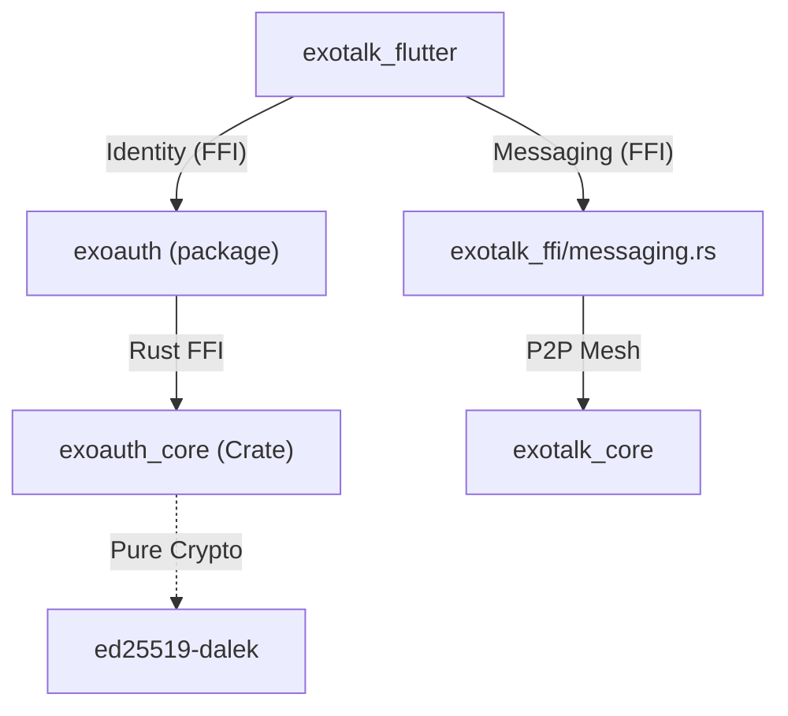

# Walkthrough 67: exoauth_core Modularization

## Objective
Decouple the identity engine from `exotalk_engine` into a standalone `exoauth_core` Rust crate. This ensures that identity logic (DID, keys, proofs) can be utilized across different host applications (ExoTalk, ThreeSteps, Republet) independently of the Iroh P2P networking stack.

## Key Accomplishments

### 1. Identity Extraction
- **Crate Creation**: Initialized `exoauth_core` at `exoauth/rust/`.
- **Logic Relocation**: Moved DID generation, key management, OAuth linking, verified links, name history, and profile bundling to the new crate.
- **Portability**: The crate is focused on cryptographic operations and has no dependencies on Iroh or networking.

### 2. Messaging Refactoring
- **Module Creation**: Extracted messaging-specific logic into `exotalk_ffi/src/api/messaging.rs`.
- **Stateless API**: Refactored `initWillowDatabase` and `delegateCapability` to require explicit `did` and `secret` parameters.
- **Decoupling**: Messaging implementation no longer relies on a global identity state.

### 3. FFI & Host Integration
- **Binding Generation**: Updated FFI bindings for `exoauth` and `exotalk_flutter`.
- **Public API Surface**: Updated `exoauth/lib/exoauth.dart` to re-export FFI functions.
- **Dart Migration**: Updated host application files to utilize identity types from the `exoauth` package.

## Verification Results

### Automated Analysis
- **Rust**: `cargo check` verified for `exotalk_ffi` and `exoauth_core`.
- **Flutter**: `flutter analyze` confirms zero errors across `exotalk_flutter` and `exoauth`.

### Architecture Overview

## Educational Context: Initialization Pattern
By requiring explicit credentials for `initWillowDatabase`, the Identity Provider (`exoauth`) manages the P2P stack initialization. The network boots after a valid identity is provided, ensuring all interactions are cryptographically attributed.
