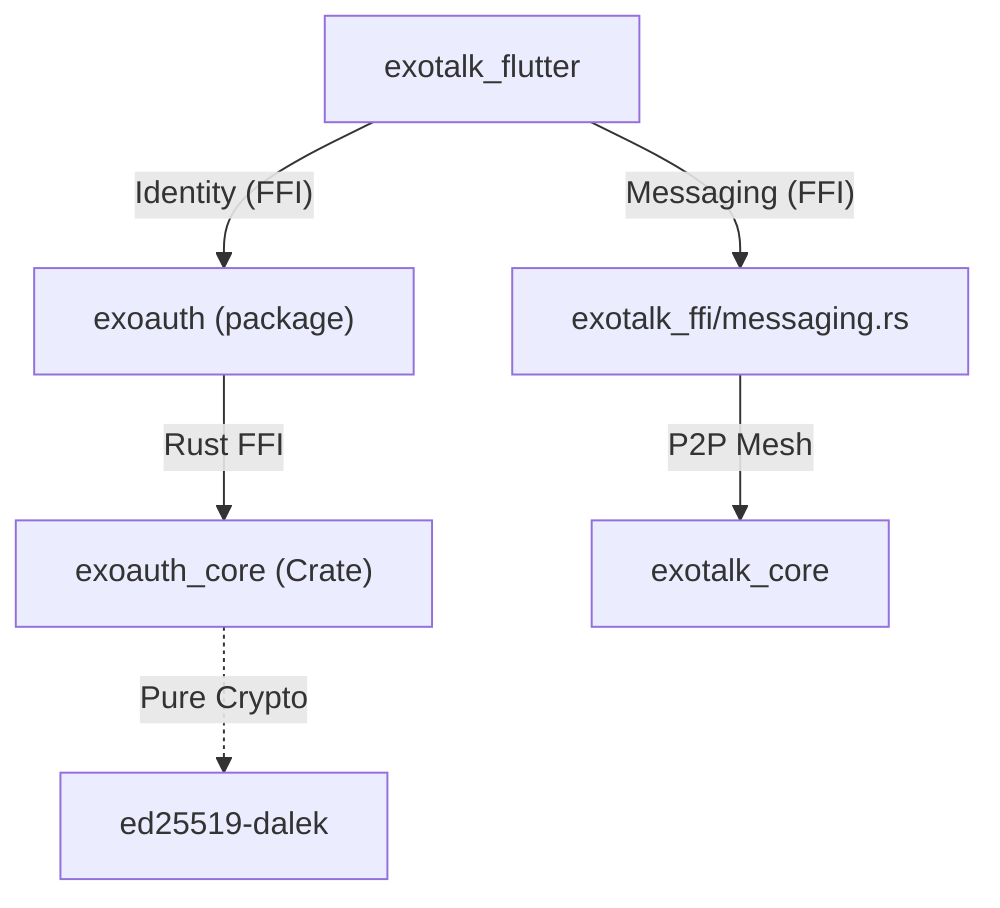

# Walkthrough 67: exoauth_core Modularization

## Objective
Decouple the sovereign identity engine from the monolithic `exotalk_engine` into a portable, standalone `exoauth_core` Rust crate. This ensures that identity logic (DID, keys, proofs) can be reused across different host applications (ExoTalk, ThreeSteps, Republet) without carrying the weight of the Iroh P2P networking stack.

## Key Accomplishments

### 1. Identity Extraction
- **Crate Creation**: Initialized `exoauth_core` at `exoauth/rust/`.
- **Logic Relocation**: Moved DID generation, key management, OAuth linking, verified links, name history, and profile bundling from `willow.rs` to the new crate.
- **Portability**: The new crate is "pure crypto" and has zero dependencies on Iroh or networking, making it extremely lightweight.

### 2. Messaging Decomposition
- **Module Creation**: Extracted chat-specific logic into `exotalk_ffi/src/api/messaging.rs`.
- **Stateless API**: Refactored `initWillowDatabase` and `delegateCapability` to accept explicit `did` and `secret` parameters.
- **Decoupling**: Messaging no longer relies on a global static identity state, allowing for better multi-tenancy and testing.

### 3. FFI & Host Integration
- **Binding Generation**: Re-ran `flutter_rust_bridge_codegen` for both `exoauth` and `exotalk_flutter`.
- **Public API Surface**: Updated `exoauth/lib/exoauth.dart` to re-export the generated FFI functions, preventing "implementation import" warnings in host apps.
- **Dart Migration**: Updated 10+ files in `exotalk_flutter` to import identity types from the `exoauth` package instead of the legacy `willow.dart`.

## Verification Results

### Automated Analysis
- **Rust**: `cargo check` passes on `exotalk_ffi` and `exoauth_core`.
- **Flutter**: `flutter analyze` on `exotalk_flutter` returns **0 errors and 0 warnings**.
- **Package**: `flutter analyze` on `exoauth` returns **0 errors**.

### Architecture Overview

## 🧠 Educational Context: The "Gatekeeper" Pattern
By making `initWillowDatabase` require explicit credentials, we have established the Identity Provider (`exoauth`) as the gatekeeper of the P2P stack. The network now only boots *after* a valid sovereign identity is selected and provided, ensuring that all mesh interactions are cryptographically attributed from the first byte.
